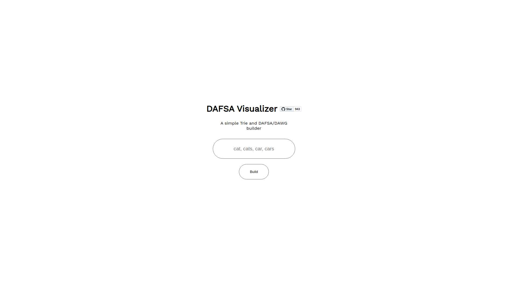
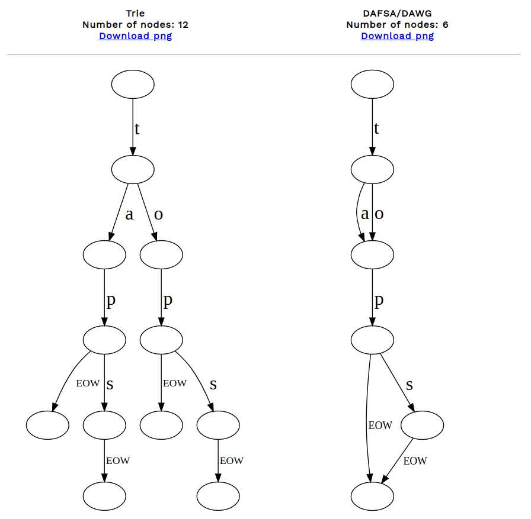

# Trie & DAWG visualizer
A simple  trie and dawg visualizer using [GraphViz](http://www.graphviz.org/) in TS

### How it works
The program first builds a [Trie](https://en.wikipedia.org/wiki/Trie) and them performs a [DFA minimization](https://en.wikipedia.org/wiki/DFA_minimization) to convert it into a [DAWG](https://en.wikipedia.org/wiki/Deterministic_acyclic_finite_state_automaton).

There are 2 ways of creating a DAFSA/DAWG:
- Creating a trie then minimizing it
- Creating a dawg in one step

### Examples

